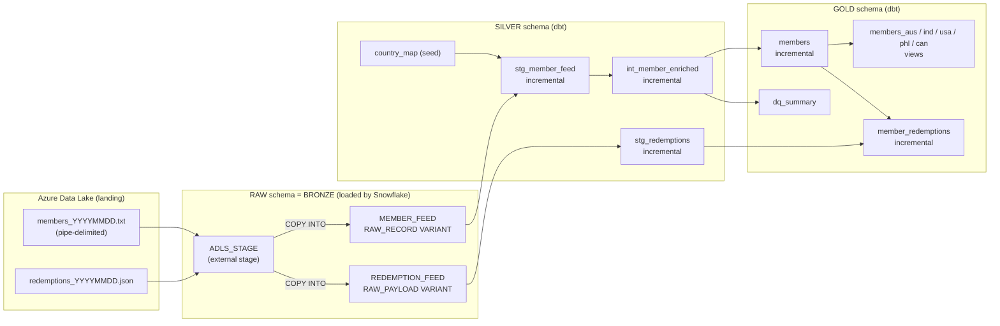

# Incubyte SkyPoints DE Assessment

## Problem Statement:
I run a global airline loyalty program called SkyPoints, with lounges and partner airlines across the world. Every member enrolled in the program is issued a Membership Card that lets them access any partner lounge 
worldwide, redeem miles, and track their tier status.

## Current Status:
We maintain all members in one database. There are millions of members enrolled in the program. So, I decided to split up the members based on the country and load them into corresponding country tables.
To pull the members as per Country, my developers should know what are all the places the Member Data is available. So, the data extraction will be done by our Source System. It will pull all the relevant member data 
and give us two feeds every day: a flat file of member profile data, and a semi-structured JSON feed of mileage redemption transactions from our partner airlines.

## Technical Assessment: Deliverables
1. Create table queries – DDL for the raw/landing table, the staging table, and the country-specific target 
tables (e.g., in Snowflake).
2. Load the staging table with additional derived columns: Age (computed from DOB) and a Stale_Member 
flag where days since Flight_Date > 90.
3. Write the transformation logic (SQL and/or Python) to split members into their per-country target tables, 
applying the “latest record wins” rule when a member has moved countries.
4. Parse the semi-structured JSON redemption feed into a flattened, queryable table, and describe how you 
would join it back to the member profile data.
5. Create the necessary data validations — mandatory field checks, key-column uniqueness, and any checks 
you would add to catch the kind of data issues visible in the sample data above.
6. If we move forward with an interview, we would like to see a live demonstration.
<br><br><br>

# Solution Documentation

An end-to-end ELT pipeline that moves airline loyalty data from **Azure Data Lake** into **Snowflake** and transforms it with **dbt** using a **medallion (bronze / silver / gold)** architecture.

Two partner feeds are processed:

1. A daily **pipe-delimited flat file** of members (multiple countries in one file).
2. A daily **JSON feed** of redemption transactions (nested array per member).

The pipeline cleans and types the data, derives business columns (age, tier name, `stale_member`), flags bad records instead of dropping them, splits members into per-country tables (applying **"latest record wins"** when a member moves country), flattens the JSON redemptions, and joins them back to the member profile. Silver and gold are **incremental**, so a daily run only processes what changed.

---

## Table of contents

1. [Assessment deliverables and where each one lives](#1-assessment-deliverables-and-where-each-one-lives)
2. [Architecture](#2-architecture)
3. [Data flow, step by step](#3-data-flow-step-by-step)
4. [Source data](#4-source-data)
5. [Layers: what, where, why](#5-layers-what-where-why)
6. [Snowflake objects](#6-snowflake-objects)
7. [Repository structure](#7-repository-structure)
8. [Model reference](#8-model-reference)
9. [Business rules](#9-business-rules)
10. [Latest record wins (member moves country)](#10-latest-record-wins-member-moves-country)
11. [Incremental design](#11-incremental-design)
12. [Redemption feed: flatten and join](#12-redemption-feed-flatten-and-join)
13. [Data quality and tests](#13-data-quality-and-tests)
14. [How to run](#14-how-to-run)
15. [Assumptions](#15-assumptions)
16. [Design decisions (why)](#16-design-decisions-why)
17. [Known limitations](#17-known-limitations)
18. [Troubleshooting notes](#18-troubleshooting-notes)
19. [Production roadmap](#19-production-roadmap)
20. [Security and repo hygiene](#20-security-and-repo-hygiene)

---

## 1. Assessment deliverables and where each one lives

| Deliverable | Implementation | Location |
|---|---|---|
| Ingest partner flat file from the data lake into Snowflake | Storage integration, external stage, `COPY INTO` into a VARIANT raw table | `RAW.MEMBER_FEED`, `snowflake_setup/` |
| Clean, type and standardise member data | Staging model: header filter, `YYYYMMDD` / `DDMMYYYY` date parsing, country-code mapping via seed | `stg_member_feed`, seed `country_map` |
| Derived columns | `tier_name`, `age_at_enrollment`, `current_age`, `days_enrollment_to_flight`, `days_since_last_flight`, **`stale_member`** (> 90 days since last flight) | `int_member_enriched` |
| Data-quality handling | Bad rows are kept and flagged (`dq_status`, `dq_issues`), never silently dropped | `int_member_enriched`, `dq_summary` |
| Split members into per-country target tables | One `members` table plus one model per country (`AUS`, `IND`, `USA`, `PHL`, `CAN`) | `GOLD.MEMBERS`, `GOLD.MEMBERS_<CC>` |
| "Latest record wins" when a member moves country | Dedup on `member_id` ordered by file date, then load time; country tables filter the deduplicated set; move trail kept in `previous_country_code` | `stg_member_feed`, [section 10](#10-latest-record-wins-member-moves-country) |
| Parse the semi-structured JSON redemption feed into a flattened, queryable table | `LATERAL FLATTEN` on the `redemptions` array, one row per transaction | `stg_redemptions` |
| Describe how to join redemptions back to the member profile | Left join on `member_id`, orphan flag, one row per `txn_id` | `member_redemptions`, [section 12](#12-redemption-feed-flatten-and-join) |
| Incremental processing | Merge-based incremental models with watermarks and row hashes | [section 11](#11-incremental-design) |
| Tests and audit | 80 dbt tests plus a `dq_summary` audit table | [section 13](#13-data-quality-and-tests) |

---

## 2. Architecture



### Technology stack

| Component | Technology | Role |
|---|---|---|
| Landing zone | Azure Data Lake Storage (Blob) | Receives partner files |
| Warehouse | Snowflake | Storage and compute |
| Access to the lake | Snowflake storage integration + external stage | Secure read without keys in SQL |
| Transformation | dbt Core 1.12 with `dbt-snowflake` | Models, tests, seeds, lineage |
| Package | `dbt-labs/dbt_utils` | Surrogate keys, `unique_combination_of_columns`, `accepted_range` |
| Authentication | Key-pair auth for a Snowflake service user | Non-interactive dbt connection |
| Editor | VS Code | Development |

---

## 3. Data flow, step by step

1. **Partner uploads** a dated file to the data lake, e.g. `raw/members_20261002.txt` or `raw/redemptions_20241002.json`. Dated names matter: Snowflake remembers loaded file names and skips repeats.
2. **Snowflake reads the lake** through `ADLS_STAGE`, which uses the storage integration `SKYPOINTS_ADLS_INT`.
3. **`COPY INTO` loads bronze.** Every member line becomes one row in `RAW.MEMBER_FEED`. Fields are packed into a VARIANT (`RAW_RECORD`) together with audit columns (source file, batch ID, row number, load timestamp). Each JSON document becomes one row in `RAW.REDEMPTION_FEED`. **Nothing is cast, cleaned or dropped**, so bad values such as an invalid date are preserved exactly as received.
4. **`stg_member_feed` (silver)** drops the header record, extracts and types each field, maps country codes through the seed, hashes each row, keeps the newest record per member, and merges only new or changed members.
5. **`int_member_enriched` (silver)** adds business-derived columns and data-quality flags.
6. **`members` (gold)** is the unified, consumer-ready member table. The five **country models** are views filtered on `country_code`.
7. **`stg_redemptions` (silver)** flattens the nested `redemptions` array into one row per transaction and keeps the latest version of each `txn_id`.
8. **`member_redemptions` (gold)** left-joins redemptions to `members`.
9. **`dq_summary` (gold)** aggregates data-quality counts per country, batch and file.

---

## 4. Source data

### 4.1 Member flat file (pipe-delimited)

**Header record**

```
|H|Member_Name|Member_Id|Enrollment_Date|Last_Flight_Date|Tier_Code|Agent_Name|State|Country|DOB|Is_Active
```

**Detail record layout**

```
|D|Elena|223457|20101012|20121013|GLD|Sam|CA|USA|03051985|A
```

| Position in Snowflake | Field | Format / notes |
|---|---|---|
| `$1` | (empty) | Every line starts with `\|`, so the first field is empty |
| `$2` | Record type | `H` header, `D` detail |
| `$3` | Member_Name | text |
| `$4` | Member_Id | string, variable length |
| `$5` | Enrollment_Date | `YYYYMMDD` |
| `$6` | Last_Flight_Date | `YYYYMMDD` |
| `$7` | Tier_Code | `PLT`, `GLD`, `SLV` |
| `$8` | Agent_Name | text |
| `$9` | State | text |
| `$10` | Country | `USA`, `IND`, `AU`, `PHIL`, `CAN` (inconsistent codes, mapped via seed) |
| `$11` | DOB | `DDMMYYYY` (assumption) |
| `$12` | Is_Active | `A` = active (assumption) |

Sample file (day 1):

```
|H|Member_Name|Member_Id|Enrollment_Date|Last_Flight_Date|Tier_Code|Agent_Name|State|Country|DOB|Is_Active
|D|Elena|223457|20101012|20121013|GLD|Sam|CA|USA|03051985|A
|D|Ravi|223458|20101012|20121013|SLV|Sam|TN|IND|03051985|A
|D|Mateo|223459|20101012|20121013|GLD|Sam|NCR|PHIL|03051985|A
|D|Nora|22345|20101012|20121013|PLT|Sam|ONT|CAN|03051985|A
|D|Jacob|2256|20101012|20121013|SLV|Sam|VIC|AU|03051985|A
```

### 4.2 Redemption JSON feed

```json
{
  "member_id": "223457",
  "feed_date": "20240115",
  "redemptions": [
    { "txn_id": "RX10091", "txn_date": "20240110", "partner": "AeroLink", "miles_redeemed": 12000, "status": "COMPLETED" },
    { "txn_id": "RX10092", "txn_date": "20240113", "partner": "SkyPoints", "miles_redeemed": 5000,  "status": "PENDING" }
  ]
}
```

One document per member per feed; each holds an array of transactions. The same `txn_id` can be re-sent in later feeds with a new status (for example `PENDING` then `COMPLETED`).

### 4.3 Country mapping seed

`seeds/country_map.csv` converts the codes found in the file to standard codes:

| source_code | country_code | country_name |
|---|---|---|
| AU | AUS | Australia |
| AUS | AUS | Australia |
| IND | IND | India |
| USA | USA | United States |
| PHIL | PHL | Philippines |
| CAN | CAN | Canada |

Unmapped codes become `UNKNOWN` and are caught by a `relationships` test and the DQ flags.

---

## 5. Layers: what, where, why

| Layer | Schema | Objects | Built by | Purpose |
|---|---|---|---|---|
| **Bronze** | `RAW` | `MEMBER_FEED`, `REDEMPTION_FEED`, stage `ADLS_STAGE`, file formats `FF_PIPE`, `FF_JSON` | Snowflake (`COPY INTO`) | Data **exactly as received**. Append-only. Full audit trail and replay source. |
| **Silver** | `SILVER` | `stg_member_feed`, `int_member_enriched`, `stg_redemptions`, seed `country_map` | dbt | Cleaned, typed, deduplicated, enriched, flagged. |
| **Gold** | `GOLD` | `members`, `members_aus/ind/usa/phl/can`, `member_redemptions`, `dq_summary` | dbt | Consumer-ready tables. |

### Why this shape

- **Bronze never changes data.** If a parsing rule is wrong, silver can be rebuilt from bronze. Bad rows can be investigated against the original text.
- **VARIANT in bronze.** The partner's layout can change (new column, different order) without breaking the load. dbt maps fields in one place.
- **Silver is split into `stg_` and `int_`.** `stg_` answers "what does the source look like, cleaned?" and changes when the source changes. `int_` answers "what does the business want to know?" and changes when rules change. Each can be edited without risking the other.
- **Gold is read-optimised.** Consumers get one unified table for cross-country reporting, plus per-country tables.
- **`dbt` reads RAW but never writes to it.** The dbt role has `SELECT` only on `RAW`, which protects raw data from accidental overwrites. The dbt folder name `staging` means "first cleaning step" in dbt vocabulary; it lives in `SILVER`, not bronze.

---

## 6. Snowflake objects

| Object | Name | Notes |
|---|---|---|
| Database | `SKYPOINTS_DBT_DB` | |
| Schemas | `RAW`, `SILVER`, `GOLD`, `DBT_DEV` (default target, empty) | |
| Warehouse | `SKYPOINTS_DBT_WH` | `AUTO_SUSPEND = 60`, `AUTO_RESUME = TRUE` |
| Role | `SKYPOINTS_DBT_ROLE` | `SELECT` on `RAW`; all privileges on `SILVER`, `GOLD`, `DBT_DEV` |
| Service user | `SKYPOINTS_DBT_SERVICE` | `TYPE = SERVICE`, key-pair authentication |
| Storage integration | `SKYPOINTS_ADLS_INT` | Read access to the lake |
| External stage | `RAW.ADLS_STAGE` | Points to the landing container |
| File formats | `RAW.FF_PIPE`, `RAW.FF_JSON` (and `FF_CSV` from the early CSV prototype) | |
| Raw tables | `RAW.MEMBER_FEED`, `RAW.REDEMPTION_FEED` | |

### Raw table shapes

```sql
CREATE TABLE SKYPOINTS_DBT_DB.RAW.MEMBER_FEED (
    COUNTRY_CODE     VARCHAR,
    SOURCE_FILE_NAME VARCHAR,
    BATCH_ID         VARCHAR,
    ROW_NUMBER       NUMBER,
    RAW_RECORD       VARIANT,
    LOAD_TIMESTAMP   TIMESTAMP_NTZ DEFAULT CURRENT_TIMESTAMP()
);

CREATE TABLE SKYPOINTS_DBT_DB.RAW.REDEMPTION_FEED (
    SOURCE_FILE_NAME VARCHAR,
    BATCH_ID         VARCHAR,
    RAW_PAYLOAD      VARIANT,
    LOAD_TIMESTAMP   TIMESTAMP_NTZ DEFAULT CURRENT_TIMESTAMP()
);
```

### File formats

```sql
CREATE OR REPLACE FILE FORMAT SKYPOINTS_DBT_DB.RAW.FF_PIPE
    TYPE = CSV
    FIELD_DELIMITER = '|'
    SKIP_HEADER = 0                      -- header is loaded; silver filters Record_Type = 'D'
    FIELD_OPTIONALLY_ENCLOSED_BY = '"'
    EMPTY_FIELD_AS_NULL = TRUE
    NULL_IF = ('NULL', 'null', '')
    ERROR_ON_COLUMN_COUNT_MISMATCH = FALSE;

CREATE OR REPLACE FILE FORMAT SKYPOINTS_DBT_DB.RAW.FF_JSON
    TYPE = JSON
    STRIP_OUTER_ARRAY = TRUE;
```

`SKIP_HEADER = 0` is deliberate: the header may wrap onto two lines, and a trailer line might be added. Filtering on `Record_Type = 'D'` in silver is robust to both, while `SKIP_HEADER = 1` only skips one line regardless of content.

### Loading bronze

**Member flat file**

```sql
COPY INTO SKYPOINTS_DBT_DB.RAW.MEMBER_FEED
    (COUNTRY_CODE, SOURCE_FILE_NAME, BATCH_ID, ROW_NUMBER, RAW_RECORD)
FROM (
    SELECT
        $10,
        METADATA$FILENAME,
        'MBR_' || REGEXP_SUBSTR(METADATA$FILENAME, '[0-9]{8}'),
        METADATA$FILE_ROW_NUMBER,
        OBJECT_CONSTRUCT_KEEP_NULL(
            'Record_Type',      $2,
            'Member_Name',      $3,
            'Member_Id',        $4,
            'Enrollment_Date',  $5,
            'Last_Flight_Date', $6,
            'Tier_Code',        $7,
            'Agent_Name',       $8,
            'State',            $9,
            'Country',          $10,
            'DOB',              $11,
            'Is_Active',        $12
        )
    FROM @SKYPOINTS_DBT_DB.RAW.ADLS_STAGE
)
FILES = ('members_20261002.txt')          -- add folder prefix if the file is in a subfolder
FILE_FORMAT = (FORMAT_NAME = 'SKYPOINTS_DBT_DB.RAW.FF_PIPE')
ON_ERROR = 'ABORT_STATEMENT';
```

`OBJECT_CONSTRUCT_KEEP_NULL` keeps keys whose value is NULL. Plain `OBJECT_CONSTRUCT` would silently drop them, and a JSON `null` would then behave differently from a missing key. The batch ID is derived from the date in the file name.

**Redemption JSON**

```sql
COPY INTO SKYPOINTS_DBT_DB.RAW.REDEMPTION_FEED
    (SOURCE_FILE_NAME, BATCH_ID, RAW_PAYLOAD)
FROM (
    SELECT METADATA$FILENAME,
           'RDM_' || REGEXP_SUBSTR(METADATA$FILENAME, '[0-9]{8}'),
           $1
    FROM @SKYPOINTS_DBT_DB.RAW.ADLS_STAGE
)
FILES = ('redemptions_20241002.json')
FILE_FORMAT = (FORMAT_NAME = 'SKYPOINTS_DBT_DB.RAW.FF_JSON')
ON_ERROR = 'ABORT_STATEMENT';
```

Snowflake skips a file name it has already loaded. To deliberately reload, add `FORCE = TRUE`.

---

## 7. Repository structure

```
incubyte_skypoints/
├── dbt_project.yml
├── packages.yml
├── README.md
├── macros/
│   └── generate_schema_name.sql        # use SILVER / GOLD exactly, no DBT_DEV_ prefix
├── seeds/
│   └── country_map.csv
├── models/
│   ├── staging/
│   │   ├── _sources.yml                # RAW.member_feed, RAW.redemption_feed
│   │   ├── _stg_models.yml             # tests
│   │   ├── stg_member_feed.sql
│   │   └── stg_redemptions.sql
│   ├── intermediate/
│   │   └── int_member_enriched.sql
│   └── marts/
│       ├── _marts_models.yml           # tests
│       ├── members.sql
│       ├── members_aus.sql
│       ├── members_ind.sql
│       ├── members_usa.sql
│       ├── members_phl.sql
│       ├── members_can.sql
│       ├── member_redemptions.sql
│       └── dq_summary.sql
├── tests/                              # custom singular tests
│   ├── assert_flight_not_before_enrollment.sql
│   ├── assert_gold_row_count_matches_silver.sql
│   ├── assert_member_in_one_country_table.sql
│   └── assert_redemptions_not_empty.sql
└── snowflake_setup/                    # SQL that lives outside dbt
    ├── 01_roles_warehouse_db.sql
    ├── 02_storage_integration_stage.sql
    ├── 03_file_formats_raw_tables.sql
    └── 04_copy_into.sql
```

### `dbt_project.yml` (key parts)

```yaml
name: incubyte_skypoints
profile: incubyte_skypoints

models:
  incubyte_skypoints:
    staging:
      +materialized: table       # overridden per model with incremental config
      +schema: SILVER
    intermediate:
      +materialized: table
      +schema: SILVER
    marts:
      +materialized: table
      +schema: GOLD

seeds:
  incubyte_skypoints:
    +schema: SILVER

vars:
  stale_days_threshold: 90
  as_of_date: null               # null = current_date(); set for reproducible runs
```

The project name under `models:` and `seeds:` must match `name:` exactly; a mismatch is silently ignored by dbt.

### `macros/generate_schema_name.sql`

By default dbt builds `<target_schema>_<custom_schema>` (for example `DBT_DEV_SILVER`). This macro makes it use the schema name exactly as configured:

```sql

    
        {{ target.schema }}
    
        {{ custom_schema_name | trim }}
    

```

---

## 8. Model reference

| Model | Schema | Materialization | Grain | Purpose |
|---|---|---|---|---|
| `stg_member_feed` | SILVER | incremental (merge on `member_id`) | 1 row per member | Parse, type, map country, hash, dedup, merge changes |
| `int_member_enriched` | SILVER | incremental (merge on `member_id`) | 1 row per member | Derived columns and DQ flags |
| `stg_redemptions` | SILVER | incremental (merge on `txn_id`) | 1 row per transaction | Flatten JSON, type, keep latest version |
| `members` | GOLD | incremental (merge on `member_id`) | 1 row per member | Unified member table |
| `members_aus`, `_ind`, `_usa`, `_phl`, `_can` | GOLD | **view** over `members` | 1 row per member | Per-country target tables |
| `member_redemptions` | GOLD | incremental (merge on `txn_id`) | 1 row per transaction | Redemptions joined to members |
| `dq_summary` | GOLD | table | per country, batch, file | Data-quality audit |
| `country_map` | SILVER | seed | 1 row per source code | Code standardisation |

### `stg_member_feed`

1. Reads `RAW.MEMBER_FEED`, keeps `Record_Type = 'D'` (drops header and any trailer).
2. **Incremental filter:** only bronze rows with `load_timestamp` greater than the maximum already in silver.
3. Extracts fields from the VARIANT, trims and upper-cases codes.
4. Left-joins `country_map` to produce `country_code` (`UNKNOWN` if unmapped).
5. Parses dates with `try_to_date` (`YYYYMMDD` for enrollment and flight; `DDMMYYYY` for DOB). Invalid values become NULL while the `*_raw` columns remain for comparison.
6. Computes `row_hash` (MD5 of the business attributes) so unchanged members can be recognised.
7. Keeps the newest record per `member_id` within the batch.
8. When running incrementally, joins to the existing silver row and:
   - passes through only **new** members or members whose `row_hash` **changed**,
   - ignores a late-arriving **older** file (compares `file_date`),
   - sets `previous_country_code` from the existing row when the country changed.

### `int_member_enriched`

Adds, per member:

| Column | Rule |
|---|---|
| member_key | Surrogate key from `member_id` |
| tier_name | `PLT` Platinum, `GLD` Gold, `SLV` Silver |
| age_at_enrollment, current_age | Completed years (corrects the calendar-boundary error of a plain `datediff('year')`) |
| days_enrollment_to_flight | Days between enrollment and last flight |
| has_flown | `flight_date is not null` |
| days_since_last_flight | `as_of_date` (or today) minus `flight_date` |
| stale_member | `days_since_last_flight > 90` (strictly greater; NULL flight date gives `false`) |
| country_changed | `previous_country_code is not null` |
| DQ flags | `is_enrollment_date_invalid`, `is_flight_date_invalid`, `is_dob_missing_or_invalid`, `is_flight_before_enrollment`, `is_unknown_country` |
| dq_issues | Comma-separated list of triggered flags |
| dq_status | `OK` or `REVIEW` |

### `members` and country models

`members` selects the final column list from `int_member_enriched`, merging only rows with a newer `_updated_at`. Each country model is one line:

```sql
{{ config(materialized='view') }}
select * from {{ ref('members') }} where country_code = 'AUS'
```

### `dq_summary`

Counts total, OK and REVIEW rows, each invalid-date and missing-DOB flag, stale members and inactive members per `country_code`, `batch_id`, `source_file_name`.

---

## 9. Business rules

| Rule | Implementation |
|---|---|
| Header / trailer rows are not data | Filter `Record_Type = 'D'` |
| Dates | `YYYYMMDD`, DOB `DDMMYYYY`; `try_to_date` returns NULL instead of failing |
| Invalid dates | Kept as NULL with the raw value beside it, flagged in `dq_issues`, warned by tests |
| Country codes | Standardised via seed; `AU` becomes `AUS`, `PHIL` becomes `PHL` |
| Tier | `PLT`, `GLD`, `SLV` only; anything else fails a test |
| Active | `Is_Active = 'A'` is active, anything else inactive |
| Stale member | **More than 90 days** since `Last_Flight_Date`, measured against `as_of_date` (default: today). Exactly 90 days is not stale. A NULL flight date is **not** stale (stated assumption) |
| Bad rows | Flagged, never dropped |
| Member identity | `Member_Id` is unique across all countries |

---

## 10. Latest record wins (member moves country)

**Scenario.** On day 1 Elena is listed in `USA`. On day 2 the file lists her in `PHIL`. She must appear **only** in the Philippines table.

**How the pipeline guarantees this**

1. **Bronze keeps both records** (append-only). Nothing is lost.
2. **Silver deduplicates on `member_id` before any country split.** The order is: file date from the file name (newest first), then load timestamp, then file name, then row number. One row per member survives, whatever its country.
3. **Gold country tables are views over the deduplicated `members` table**, filtering on `country_code`. A member can only be in one of them, and there is no stale copy to clean up when someone moves.
4. **The move is recorded.** `previous_country_code` and `country_changed` show where the member came from.

Why views for the country tables: an incremental table can insert and update, but it cannot remove a row from the *old* country's table. A view cannot hold a stale copy.

**Proof tests**

- `assert_member_in_one_country_table`: no `member_id` appears in more than one country table.
- `assert_gold_row_count_matches_silver`: the five country tables add up to the silver row count (this also catches a member whose country is `UNKNOWN` because that member lands in no country table).

**Result for the sample**

| member_id | day 1 | day 2 | `members_usa` | `members_phl` | `previous_country_code` | `country_changed` |
|---|---|---|---|---|---|---|
| 223457 | USA | PHIL | no | **yes** | USA | true |

### SCD classification

The member table is **Type 1 for most attributes** (overwritten) and **Type 3 for country** (one prior value in the same row). It is not a pure Type 3: there is no effective-date column, only the last move is kept, and `previous_country_code` is derived from the existing silver row, so it is lost on `--full-refresh`. **Full history is retained in bronze**, so a Type 2 history table (or a dbt snapshot) can be built from it if required.

---

## 11. Incremental design

Goal: a daily run touches only members and transactions that changed, even if the daily volume grows very large.

| Layer | Strategy | What happens on a normal daily run |
|---|---|---|
| Bronze | Append-only `COPY INTO` | Snowflake loads new files and skips already-loaded file names |
| stg_member_feed | Incremental `merge` on `member_id` | Reads only bronze rows newer than silver's max `load_timestamp`; drops members whose `row_hash` is unchanged; merges the rest |
| int_member_enriched | Incremental `merge` | Reads rows with `_updated_at` newer than its own max |
| members | Incremental `merge` | Same watermark on `_updated_at` |
| Country models | View | Nothing to load |
| stg_redemptions | Incremental `merge` on `txn_id` | Flattens only newly loaded JSON rows; a re-sent transaction updates its row |
| member_redemptions | Incremental `merge` on `txn_id` | Same watermark on `_updated_at` |

**Example.** The day-2 member file repeats day 1 with one member moved. Five detail rows are read from bronze, four are discarded by the hash comparison, and **one row** is merged through silver and gold.

**Guards**

- A **late-arriving older file** cannot overwrite newer data (file-date comparison).
- **`--full-refresh`** rebuilds from all of bronze and is the recovery path after any logic change. Incremental models do not self-heal: a merge never deletes bad rows written by an earlier run.

---

## 12. Redemption feed: flatten and join

### Flatten

```sql
from source s,
     lateral flatten(input => s.raw_payload:redemptions) r
```

`LATERAL FLATTEN` turns each element of the `redemptions` array into its own row and repeats the parent fields (`member_id`, `feed_date`) beside it. One JSON document with two transactions becomes two rows.

> Watch the key name. `FLATTEN` on a key that does not exist (for example `redemption` instead of `redemptions`) returns **zero rows with no error**.

Dates (`YYYYMMDD`) are parsed with `try_to_date`. Duplicates across daily feeds are resolved with:

```sql
qualify row_number() over (
    partition by txn_id
    order by feed_date desc nulls last, load_timestamp desc, source_file_name desc
) = 1
```

`nulls last` stops a row with an unparseable date from outranking a valid one.

### Join back to the member profile

```sql
from stg_redemptions r
left join members m
    on r.member_id = m.member_id
```

| Aspect | Decision |
|---|---|
| **Key** | `member_id`, unique in `members` (enforced by a `unique` test), so the join cannot multiply rows |
| **Join type** | **Left** join from redemptions to members, so a transaction for an unknown member is kept and flagged (`is_orphan_txn = true`), not lost |
| **Grain** | One row per transaction. For one row per member, aggregate afterwards (total miles, pending vs completed) |
| **Duplicates** | The same `txn_id` across feeds resolves to the latest version |
| **Orphans** | A `relationships` test warns on each orphan |

### Status history

`RX10092` is `PENDING` in the day-1 feed and `COMPLETED` in day 2. Silver and gold hold **current state** (`COMPLETED`). Both versions remain in bronze. If status history is required, build a model without the `qualify`, or use a dbt snapshot with a `check` strategy on `status`.

---

## 13. Data quality and tests

The project has **80 dbt data tests**. Highlights:

| Area | Tests |
|---|---|
| Keys | `unique` and `not_null` on `member_id`, `member_key`, `txn_id` |
| Reference integrity | `country_code` `relationships` to `country_map`; `member_redemptions.member_id` to `members.member_id` (warn) |
| Domain values | `tier_code` in (`PLT`,`GLD`,`SLV`); `tier_name`; `dq_status` in (`OK`,`REVIEW`); `status` in (`COMPLETED`,`PENDING`) |
| Date quality | `not_null` on `enrollment_date`, `flight_date`, `date_of_birth` with `severity: warn` (data findings, not build failures) |
| Ranges | `age_at_enrollment` between 0 and 120 (warn) |
| Booleans | `stale_member` not null and `true`/`false` |
| Country tables | `country_code` equals the table's country; `member_key` unique |
| Singular tests | Flight not before enrollment; gold row count equals silver; member in only one country table; redemptions table not empty |

**Why warn vs error.** Structural problems (duplicate keys, unknown tiers) stop the build. Bad individual values (an invalid date) are reported as warnings because the row is flagged and kept.

**Why the empty-table test.** `unique` and `not_null` pass on zero rows. A wrong `FLATTEN` key once produced an empty table that passed every other test.

### Audit

`GOLD.DQ_SUMMARY` gives, per country, batch and file: totals, OK and REVIEW counts, and counts per issue type. Row-level detail:

```sql
SELECT member_id, member_name, country_code, dq_issues
FROM SKYPOINTS_DBT_DB.GOLD.MEMBERS
WHERE dq_status = 'REVIEW';
```

---

## 14. How to run

### Prerequisites

- Python 3.9–3.12 with `dbt-core` and `dbt-snowflake` installed in a virtual environment
- A Snowflake account with the objects in [section 6](#6-snowflake-objects)
- Public key registered on `SKYPOINTS_DBT_SERVICE` (`ALTER USER ... SET RSA_PUBLIC_KEY = '...'`)

### `~/.dbt/profiles.yml`

```yaml
incubyte_skypoints:
  target: dev
  outputs:
    dev:
      type: snowflake
      account: <orgname>-<accountname>
      user: SKYPOINTS_DBT_SERVICE
      private_key_path: /path/outside/repo/rsa_key.p8
      role: SKYPOINTS_DBT_ROLE
      warehouse: SKYPOINTS_DBT_WH
      database: SKYPOINTS_DBT_DB
      schema: DBT_DEV
      threads: 4
```

### First-time setup

```bash
dbt deps                 # install dbt_utils
dbt debug                # expect: All checks passed!
dbt seed                 # build SILVER.COUNTRY_MAP
```

Load the first files into bronze (section 6), then:

```bash
dbt build --full-refresh --vars '{as_of_date: "2026-10-02"}'
```

### Daily run

1. Upload dated files to the data lake.
2. Run the two `COPY INTO` statements with the new file names.
3. Run:

```bash
dbt build --vars '{as_of_date: "2026-10-02"}'
```

Redemptions only:

```bash
dbt build --select stg_redemptions member_redemptions
```

### About `as_of_date`

`stale_member` depends on "today".

| Command | "Today" used |
|---|---|
| `dbt run` | The real `current_date()` |
| `dbt run --vars '{as_of_date: "2026-10-02"}'` | The fixed date, for reproducible results |

`--vars` takes YAML, so use a colon (`as_of_date: "..."`), not `=`.

### Useful commands

| Task | Command |
|---|---|
| Parse YAML without touching Snowflake | `dbt parse` |
| List what dbt sees | `dbt ls --select stg_redemptions` |
| Rebuild one model and everything around it | `dbt run --select +members+` |
| Rebuild incrementals from bronze | `dbt run --full-refresh` |
| Generate docs and lineage graph | `dbt docs generate && dbt docs serve` |

### Verification queries

```sql
-- Bronze: 1 header + 5 detail rows per member file
SELECT SOURCE_FILE_NAME, RAW_RECORD:"Record_Type"::STRING AS record_type, COUNT(*)
FROM SKYPOINTS_DBT_DB.RAW.MEMBER_FEED GROUP BY 1, 2 ORDER BY 1, 2;

-- Member who moved country
SELECT member_id, country_code, previous_country_code, country_changed
FROM SKYPOINTS_DBT_DB.GOLD.MEMBERS WHERE member_id = '223457';

-- Redemptions: one row per transaction
SELECT txn_id, status, member_name, country_code, is_orphan_txn
FROM SKYPOINTS_DBT_DB.GOLD.MEMBER_REDEMPTIONS ORDER BY txn_id;
```

---

## 15. Assumptions

Where the brief was ambiguous, these were assumed and should be confirmed with the data owner.

1. The pipe-delimited flat file is the **primary member feed** and replaces the earlier per-country CSV prototypes.
2. **DOB format is `DDMMYYYY`.** `03051985` is ambiguous (3 May or 5 March) and was read as 3 May.
3. Other dates are `YYYYMMDD`.
4. **`Member_Id` is unique across all countries**, so the redemption join uses `member_id` alone.
5. `Is_Active`: `A` means active; any other value means inactive.
6. `stale_member`: strictly more than 90 days since `Last_Flight_Date`; a NULL flight date is not stale.
7. For duplicate member records, the **newest file date wins**; ties are broken by load time, file name and line number.
8. For duplicate transactions, the **latest feed date wins**.
9. `PHIL` maps to ISO `PHL`; `AU` maps to `AUS`.
10. The header record may wrap onto two lines in transport and is assumed to be one line in the real file; either way it is excluded by the `Record_Type = 'D'` filter.
11. Files carry a `YYYYMMDD` date in the file name.

---

## 16. Design decisions (why)

| Decision | Reason |
|---|---|
| VARIANT in bronze | Tolerates layout changes; keeps source field names; no load failures on bad values |
| Load header, filter in silver | Handles wrapped headers and trailers; the header stays visible for audit |
| Bronze append-only, never truncated | Replay, audit, and the only place full history lives |
| `stg_` and `int_` separated | Source changes and business-rule changes are independent |
| Seed for country mapping | Reference data is versioned in Git and testable; unknown codes are flagged |
| Flag rather than drop bad rows | Nothing disappears silently; the audit table shows what was flagged |
| `try_to_date` | Bad dates become NULL and are reported instead of failing the run |
| Row hash | Cheap way to find which members actually changed in a full-snapshot daily file |
| Country tables as views | Cannot hold a stale copy after a member moves; no extra load |
| Left join for redemptions | Orphan transactions are kept and flagged |
| Separate SILVER and GOLD schemas | Layers are visible in Snowflake and can be granted separately |
| dbt role read-only on RAW | Protects raw data from accidental overwrite |
| Service user with key-pair auth | Non-interactive and no password in config |

---

## 17. Known limitations

1. **Date-dependent columns go stale for unchanged members.** `stale_member`, `days_since_last_flight` and `current_age` are computed when a row is merged. An unchanged member is not recomputed on later days. Fix: compute these in a view at read time and remove them from the incremental tables.
2. **`previous_country_code` is lost on `--full-refresh`**, because it is derived from the existing silver row. A bronze-based history model would make it durable.
3. **Only one previous country is kept** (Type 3 behaviour).
4. **`member_redemptions` copies member attributes at merge time.** If a member later moves country or an orphan's member arrives, old transactions keep the old values until rebuilt. Alternative: make it a view over `stg_redemptions` joined to `members`.
5. **Watermark is the max bronze `load_timestamp` seen in silver.** A day with no changes re-reads that day's rows and discards them by hash. Correct, slightly wasteful.
6. **Bronze grows by a full snapshot per day.** Ask the partner for delta files or apply a retention policy on old batches.
7. **Loads are manual `COPY INTO`.** Auto-ingest is described in the roadmap.
8. **`dq_summary` reflects the batch that last touched each member**, not every historical batch.
9. **No fixed-width Member_Id assumption**, but IDs are treated as strings; numeric comparison would drop leading zeros.

---

## 18. Troubleshooting notes

Problems met during development and what they taught.

| Symptom | Cause | Fix / lesson |
|---|---|---|
| Seed built in `DBT_DEV` | Project name typo under `seeds:` (`incubytes_skypoints`) | dbt silently ignores a non-matching project key |
| `models is not a list` | YAML missing `- name: <model>` | `models:` must contain a list; run `dbt parse` first |
| `invalid identifier 'STATE'` in `members` | Ran `members+` so upstream tables were stale | Use `+members+` or plain `dbt run` after column changes |
| Gold row-count test failed | Test only summed three of five country tables | Keep the test in step with the country list |
| Redemption table empty, tests green | `flatten` key typo (`redemption`) | Add the not-empty test; tests pass on zero rows |
| Every transaction matched five members | Join `on` clause missing | Compare compiled SQL in `target/compiled/` |
| Duplicate `txn_id` after a fix | Incremental merge never deletes rows from an earlier bad run | Run `--full-refresh` after any logic fix |
| `previous_country_code` NULL | Ran `--full-refresh` with both days in bronze | Replay the real daily flow: refresh with day 1, then load day 2 and run normally |
| `Object 'L' does not exist` | Missing `from latest_in_batch l` in the non-incremental branch | Both `if` and `else` branches need their own `from` |
| `$` fields shifted by one | Each line starts with `\|`, so `$1` is empty | Fields start at `$2` |

Debugging tip: Snowflake errors quote line numbers from the **compiled** SQL. Open `target/compiled/...` or `target/run/...`, not the source model.

---

## 19. Production roadmap

1. **Snowpipe auto-ingest.** Event Grid (Blob Created) → Azure Storage Queue → notification integration → `CREATE PIPE ... AUTO_INGEST = TRUE`, one pipe for the member file and one for the JSON feed, using the same `COPY INTO` bodies. Set the Event Grid subject filter to the landing folder.
2. **Orchestration.** Run `dbt build` on a schedule (dbt Cloud, ADF, Airflow, or a CI cron), after the load completes.
3. **History.** A `member_country_history` model (SCD Type 2) from bronze, and a dbt snapshot or history model for redemption status.
4. **Read-time derived columns.** Move date-dependent calculations into a view over `members`.
5. **Environments.** A `prod` target with separate schemas and a `generate_schema_name` macro that prefixes dev schemas.
6. **Sources freshness and alerting** on `load_timestamp`.
7. **Country scaling.** A new country needs one new seed row, one view model and one test block.

---

## 20. Security and repo hygiene

- The **private key, passwords and account identifiers are never committed.** Keep the `.p8` key outside the repository and reference it from `~/.dbt/profiles.yml`.
- `.gitignore`:

```
target/
dbt_packages/
logs/
.venv/
*.p8
*.pem
.env
profiles.yml
```

- Use least privilege: `SKYPOINTS_DBT_ROLE` reads `RAW` and writes only `SILVER`, `GOLD` and `DBT_DEV`.
- Storage access uses a Snowflake storage integration (Azure RBAC), so no storage keys appear in SQL.
- Placeholders such as `<orgname>-<accountname>` and `<azure tenant ID>` in this repository must be replaced locally.


